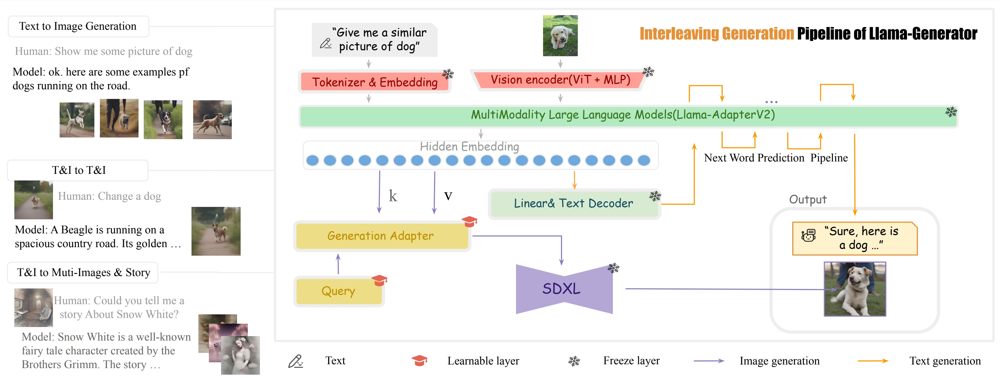

## ChatIllusion: Efficient-Aligning Interleaved Generation ability with Visual Instruction Model
The official release of ChatIllusion.
For more details, please refer to our [paper on Arxiv](https://arxiv.org/abs/2311.17963).



## Updates!!
* 【2023/11/29】 We publish our official papers on Arxiv.
## Quick Start
### Installation
**Step 0.** Install ...

**Step 1.** Install ...

**Step 2.** Install requirements.
```shell
pip install -r requirements.txt
```


### Tutorials
**Validation.**
TODO

## Cite ChatIllusion
If you use ChatIllusion in your research, please cite our work by using the following BibTeX entry:

## Thanks
We highly appreciate the effort of Llama-AdapterV2 and Stable Diffusion XL.

```latex
```
