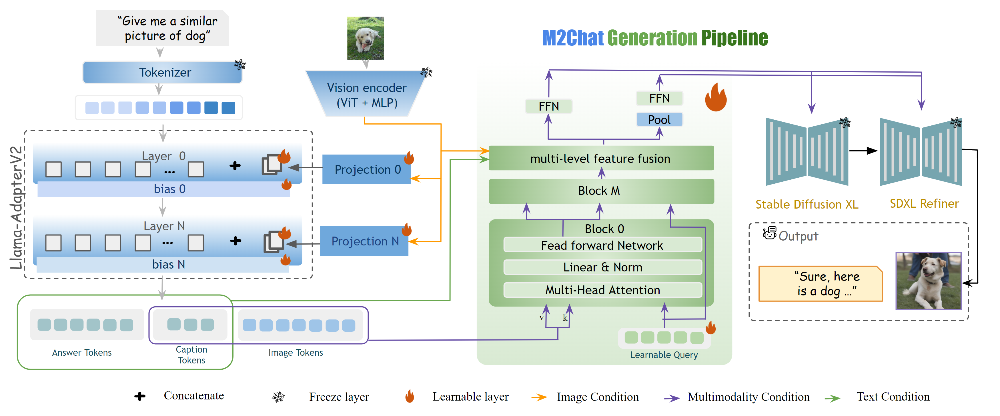

## $M^{2}Chat$: Empowering VLM for Multimodal LLM Interleaved Text-Image Generation
The official release of $M^{2}Chat$.
For more details, please refer to our [paper on Arxiv](https://arxiv.org/abs/2311.17963).




## Updates!!
* 【2023/11/29】 We publish our official papers on Arxiv.
## Quick Start
### Installation
**Step 0.** Install ...

**Step 1.** Install ...

**Step 2.** Install requirements.
```shell
pip install -r requirements.txt
```


### Tutorials
**Validation.**
TODO

## Cite $M^{2}Chat$
If you use $M^{2}Chat$ in your research, please cite our work by using the following BibTeX entry:
```@misc{chi2023$M^{2}Chat$,
      title={$M^{2}Chat$: Efficient-Aligning Interleaved Generation ability with Visual Instruction Model}, 
      author={Xiaowei Chi and Yijiang Liu and Zhengkai Jiang and Rongyu Zhang and Ziyi Lin and Renrui Zhang and Peng Gao and Chaoyou Fu and Shanghang Zhang and Qifeng Liu and Yike Guo},
      year={2023},
      eprint={2311.17963},
      archivePrefix={arXiv},
      primaryClass={cs.CV}
}
```
## Thanks
We highly appreciate the effort of Llama-AdapterV2 and Stable Diffusion XL.

```latex
```
